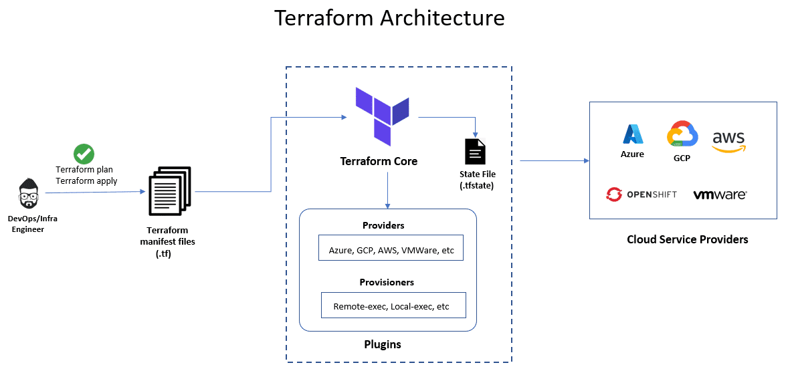

# Day 3

## Info - Terraform Overview
<pre>
- is one of the Infrastructure as a code tool (Iac)
- it is cloud newtral, hence this Iac tool can be used in any public cloud environment like AWS, Azure, GCE, etc.,
- this also called used to provision infrastructure on your on-prem data-centres
- it helps you provision containers, manage images, provision virtual machines locally or on public cloud, etc.,
- it can be used provision storage cluster, etc.,
- it can be used to provision eks, aks, ROSA, ARO on public cloud
- unlike the AWS cloudformation it works on any environment and any cloud
- it comes in 2 flavours
  1. Terraform core ( command-line only - opensource and free )
  2. Terraform Enterprise ( Web console and it is a paid tool )
</pre>

## Info - Terraform High Level Architecture


## Lab - Checking the Terraform version
```
terraform --version
```


## Info - Terraform Providers
<pre>
- Terraform depends on Providers to provision resources
- For example
  - In order to provision an ec2 instance in AWS, Terraform depends on a provider called AWS ( registry.terraform.io )
  - IN order to provision an azure VM in Azure portal, Terraform depends on a provider called Azure
  - as long as there is a provider, Terraform can provision resources on that environment
  - In case, to provision a particular type of resource within your organization and there is no read-made provider, you can
    develop your own provider in Golang using Terraform Provider SDK
  - Providers supports two types of objects/resources
    1. Resources
       - If you wish to Provision ec2 instances using Terraform, then you will define a resource block expressing your expected state
       - Terrafrom can Create, Replace, Update and Delete the resources managed by Terraform
    2. DataSources ( already existing resources - these objects will be treated by Terraform as a read-only resource )
       - these resources are not managed by Terraform
       - they are managed outside Terraform
       - Terraform can refer and use it the HCL (Hashicorp Configuration Language - Terraform's proprietary language )
       - IN case to provision certain resource you declarative terraform script(manifest) file depends on already existing resource
         then, we call them as DataSources or Data block
</pre>

## Info - Terraform Resources
<pre>
- Each Terraform Provider supports one to many Resources and one to many Datasources
- For instance, the docker provider supports the following resources
  - docker_image
  - docker_container
</pre>

## Lab - Using existing Docker Image to provision containers locally

First of all, you need a create folder
```
cd ~
mkdir -p terraform-projects/ex1
cd terraform-projects/ex1
touch main.tf
```

Create a file named main.tf
```
terraform {
  required_providers {
    docker = {
      source = "kreuzwerker/docker"
      version = "3.6.2"
    }
  }
}

provider "docker" {
  # Configuration options
}

# Terraform will consider the docker image as a read-only resource as we are using data block
data "docker_image" "tektutor_ansible_ubuntu_image" {
   name = "tektutor/ubuntu-ansible-node:latest"
}

# Terraform will consider the docker image as a read-only resource as we are using data block
data "docker_image" "tektutor_ansible_rocky_image" {
   name = "tektutor/rocky-ansible-node:latest"
}

# Terraform manages this resource, hence Terraform can Create, Replace, Update, Delete this resource (CRUD operations)
resource "docker_container" "my_ubuntu_container1" {
   image = data.docker_image.tektutor_ansible_ubuntu_image.name
   name  = "ubuntu_container_1"
}

# Terraform manages this resource, hence Terraform can Create, Replace, Update, Delete this resource (CRUD operations)
resource "docker_container" "my_rocky_container1" {
   image = data.docker_image.tektutor_ansible_rocky_image.name
   name  = "rocky_container_1"
}
```
Let's ensure the required terraform providers are downloaded by Terraform before proceeding further
```
cd ~/terraform-projects/ex1
terraform init
```


Let's verify what terraform will do if we run it
```
cd ~/terraform-projects/ex1
terraform plan
```


Let's provision the containers using our Terraform manifest script
```
cd ~/terraform-projects/ex1
terraform apply
ls -lha
cat terraform.tfstate
```


Cleaning up the resources created by Terraform once you are done with using the resources
```
terraform destroy
docker ps -a
docker images | grep ansible
```


## Lab - Terraform Input and Output variables
```
cd ~/terraform-sep-2025
git pull
cd Day3/terraform/provision-containers-with-input-and-output-variables
terraform init
terraform plan
terraform apply --auto-approve
```


You could change the container names in the inputs.tf file and perform terraform apply.  Terraform will replace the old containers with new containers with the updated container names.

Once you are done, you may dispose the resources created by terraform
```
terraform destroy --auto-approve
```


## Lab - Invoking ansible playbook from Terraform using local-exec block
```
cd ~/terraform-sep-2025
git pull
cd Day3/terraform/local-exec
ls -l
docker rm -f $(docker ps -aq)
echo "" > ~/.ssh/known_hosts

terraform init
terraform plan
terraform apply --auto-approve
docker ps
curl http://localhost:8001
curl http://localhost:8002
```


Once you are done, you may dispose the resources
```
terraform destroy --auto-approve
```


## Lab - Terraform - Running commands on the remote machine using remote-exec provisioner block
```
cd ~/terraform-sep-2025
git pull
cd Day3/terraform/remote-exec
terraform init
terraform apply --auto-approve
```


